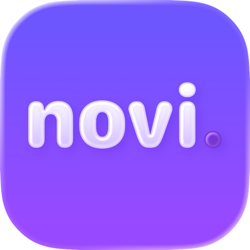

<div align="center">
  

  <h1>Novi</h1>

  <p>
    <strong>future-self journal → language tutor</strong>
  </p>

  <p>
    
    
    
  </p>
</div>

<br>

<div align="center">
  <table>
    <tr>
      <td align="center"><strong>Write</strong><br>journal in your own words</td>
      <td align="center"><strong>Translate</strong><br>live language feedback</td>
      <td align="center"><strong>Learn</strong><br>AI-made lesson from your life</td>
      <td align="center"><strong>Remember</strong><br>personal word library</td>
    </tr>
  </table>
</div>

## What Novi does

Novi turns normal journaling into personal language learning.

Write about your day. Novi translates your entry, explains useful vocabulary, pulls grammar notes from your own text, and saves words into a long-term library.

No generic drills. Your memories become lesson material.

## Built by

<div>
  <h3>Arjang + Robin</h3>
  <p>Developers of Novi.</p>
</div>

## Core features

- Notes-style journal sidebar
- Auto-save while writing
- Live translation after short pause
- AI lesson generation with vocabulary, grammar notes, and writing challenge
- Auto-generated entry titles
- Word Library built from generated lessons
- Searchable vocabulary cards
- SwiftData persistence
- SwiftUI macOS interface

## Tech stack

<table>
  <tr>
    <td><strong>App</strong></td>
    <td>SwiftUI</td>
  </tr>
  <tr>
    <td><strong>Storage</strong></td>
    <td>SwiftData</td>
  </tr>
  <tr>
    <td><strong>Language detection</strong></td>
    <td>NaturalLanguage</td>
  </tr>
  <tr>
    <td><strong>AI lessons</strong></td>
    <td>OpenAI-compatible Chat Completions API</td>
  </tr>
  <tr>
    <td><strong>Translation</strong></td>
    <td>DeepL / LibreTranslate-ready service layer</td>
  </tr>
</table>

## Run

1. Open `Novi/Novi.xcodeproj` in Xcode.
2. Select the `Novi` scheme.
3. Add `NOVI_OPENAI_API_KEY` in scheme environment variables.
4. Build and run.

## Project structure

```text
Novi/
  Novi/
    DesignSystem/     visual tokens
    Models/           SwiftData records + lesson models
    Services/         AI, translation, word library
    ViewModels/       editor state + autosave workflow
    Views/            SwiftUI app screens
    Assets.xcassets/  colors + app icon
```

<div align="center">
  <h2>Journal → lesson → memory → mastery</h2>
</div>
